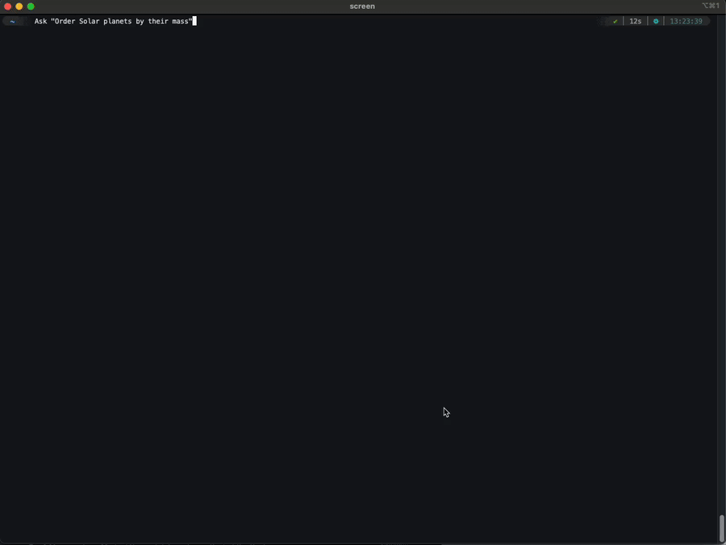
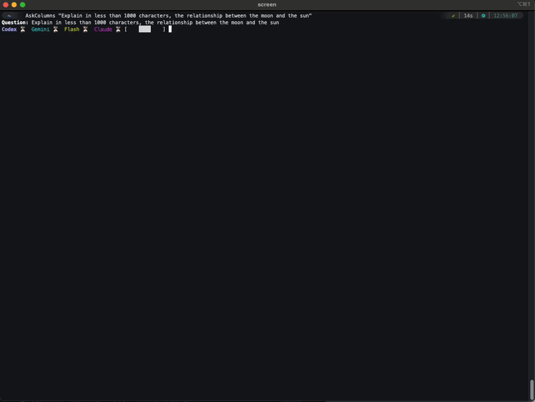

# Multi Agentic AI CLI (zsh)

Zsh functions to query multiple LLM CLIs in parallel:
- codex (OpenAI Codex CLI)
- gemini (Google Gemini CLI)
- gemini flash (2.0-flash-001)
- copilot (GitHub Copilot CLI)
- claude (Claude Code)

## Why this project
Different CLIs ship with their own system instructions, defaults, tools, and prompting UX. Running multiple CLIs in parallel for the same prompt yields diverse answers and behaviors. This lets you:
- Compare outputs and retain the best answer
- Collate complementary parts into a richer result
- Benefit from each CLI developer’s tailored setup (tools, context, defaults)

## Demos
- Streaming Ask (live spinner + per‑model blocks)
  
  

- AskColumns (two‑column summary with inline timings)
  
  

## Requirements
Tested on macOS (Apple Silicon) and zsh.
- zsh 5.9+
- CLIs on PATH: `codex`, `gemini`, `copilot`, `claude`
- API keys configured for each CLI (OpenAI/Anthropic/Google etc.)
- ffmpeg (optional) to convert demos to MP4 (`brew install ffmpeg`)

## Setup
1. Clone and source:
   `[[ -f "$HOME/Github/multi-agentic-ai-cli/scripts/multi-agent-ask.sh" ]] && source "$HOME/Github/multi-agentic-ai-cli/scripts/multi-agent-ask.sh"`
2. Verify CLIs:
   `which codex gemini copilot claude`
3. Configure keys/models (env vars or CLI configs)

## Quick Start
- One‑time exports (personal setup):
```
export ASK_HEADER_FORMAT=cli_model
# CLI names/descriptions (optional)
export ASK_NAME_CODEX=codex;   export ASK_DESC_CODEX="OpenAI Codex CLI"
export ASK_NAME_GEMINI=gemini; export ASK_DESC_GEMINI="Google Gemini CLI"
export ASK_NAME_FLASH="gemini flash"; export ASK_DESC_FLASH="Google Gemini CLI"
export ASK_NAME_COPILOT=copilot; export ASK_DESC_COPILOT="GitHub Copilot CLI"
export ASK_NAME_CLAUDE=claude; export ASK_DESC_CLAUDE="Claude Code"
# Models (personal)
export ASK_MODEL_GEMINI="gemini-pro"
export ASK_MODEL_COPILOT="gpt-5"
# Optional subscriptions
export ASK_MODEL_CODEX="gpt-5"
export ASK_MODEL_CLAUDE="claude-4"
```
- Add to `~/.zshrc`:
```
[[ -f "$HOME/Github/multi-agentic-ai-cli/scripts/multi-agent-ask.sh" ]] && source "$HOME/Github/multi-agentic-ai-cli/scripts/multi-agent-ask.sh"
```

## Usage
- `Ask "Your prompt"` — parallel stream with spinner + per‑model timings
- `AskColumns "Your prompt"` — two‑column summary (Codex|Gemini, Claude|Copilot, Flash solo)

## Personal account — suggested mix
Keep the strongest defaults without corporate dependency:
- Gemini CLI: Gemini Pro model (fast, general reasoning)
  - `ASK_HEADER_FORMAT=cli_model ASK_MODEL_GEMINI="gemini-pro"`
- GitHub Copilot CLI: GPT‑5 for coding; fallback Claude‑4 when unspecified
  - `ASK_MODEL_COPILOT="gpt-5"`
  - Configure Copilot’s default model to `claude-4` when none specified via Copilot settings (varies by account)
- Optionally enable Claude Code or Codex if you have subscriptions:
  - `ASK_MODEL_CODEX="gpt-5"` (OpenAI)
  - `ASK_MODEL_CLAUDE="claude-4"` (Anthropic)

Example:
```
export ASK_HEADER_FORMAT=cli_model
export ASK_MODEL_GEMINI="gemini-pro"
export ASK_MODEL_COPILOT="gpt-5"
# Optional
export ASK_MODEL_CLAUDE="claude-4"
export ASK_MODEL_CODEX="gpt-5"
```

## Corporate accounts — full mix (LiteLLM compatible)
When CLIs are routed via a corporate gateway (e.g., LiteLLM), all CLIs can be used safely:
- Point CLIs to the corporate base URL and models
- Keys can be tokenized via Keychain/SSO

Example:
```
export ASK_HEADER_FORMAT=cli_model
# Models
export ASK_MODEL_CODEX="gpt-5"
export ASK_MODEL_GEMINI="gemini-pro"
export ASK_MODEL_FLASH="gemini-2.0-flash-001"
export ASK_MODEL_COPILOT="gpt-5"
export ASK_MODEL_CLAUDE="claude-4"
```

## Workflow
1. `Ask` launches all CLIs in parallel and displays a single spinner line with per‑model status.
2. As each model completes, `Ask` prints a header (CLI‑first) with inline timing and the trimmed output block.
3. `AskColumns` renders a two‑column summary: Codex|Gemini, Claude|Copilot, plus a Flash‑only row.
4. You compare outputs, retain the best answer, or collate complementary parts.

## Customization
Top of `scripts/multi-agent-ask.sh`:
- CLI names + descriptions
- Models per CLI
- Header format (`cli` or `cli_model`)

## Notes
- Timing in seconds uses start time vs output file mtime.
- If terminal is narrow, AskColumns header falls back to non‑padded header to avoid cropping.
- Copilot output may include tool runs; it is captured and summarized like others.

## TODO
- Add a preflight check to verify required CLIs exist and work (codex, gemini, copilot, claude), with clear diagnostics and guidance if any are missing or misconfigured.
